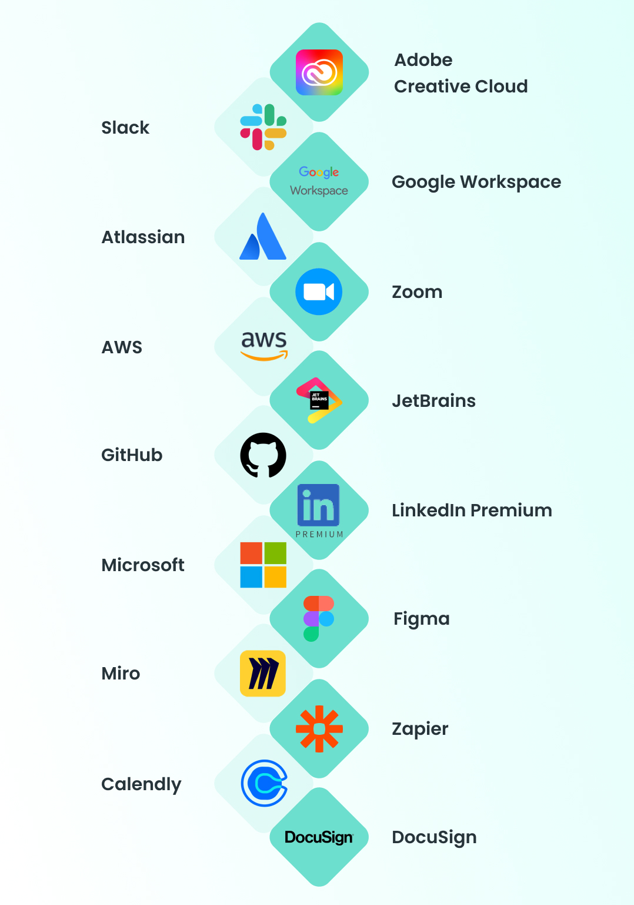

<h1 align="center">
 
   
Cloud Computing and services
</h1>

#### In this work, we will do the job about cloud technologies and services. This work was created for the purpose of educational content, as an assignment for the discipline "Cloud Technologies" of the Kyiv College of Communications.

>The work was performed by: Bilous Maya, Hubar Maksym, Slyusarchuk Anton, Mykhalyov Vladislav

---

<h1 align="center">

    Dictionary of terms:

</h1>

>Performed by Hubar Maksym:

### 1) History of cloud computing:

### 2) What is a Hypervisor:
A hypervisor is a program that manages the physical resources of a computer and distributes these resources between several different operating systems, allowing them to run simultaneously.
The hypervisor creates multiple copies, clones of hardware resources, from a single physical computer, and each clone is visible to the user as a separate device. Each virtual machine can be installed with a user's guest operating system that is not tied to the host hardware.

### 3) What is Containerization:   
Containerization is a type of virtualization strategy that emerged as an alternative to traditional hypervisor-based virtualization.
Container-based virtualization involves the creation of specific virtual pieces of hardware infrastructure, but unlike the traditional approach, which completely separates these virtual machines from the rest of the architecture, containerization simply creates individual containers at the operating system level.

### 4) What is Cloud Computing?
Cloud computing is a model for providing ubiquitous, convenient, on-demand network access to a shared pool of configurable computing resources (such as networks, servers, storage applications, and services) that can be rapidly provisioned and released with minimal administrator effort or service provider interaction (National Institute of Standards and Technology, NIST).
Cloud computing is the delivery of computing services such as servers, storage databases, networking, software, analytics, and more over the Internet

### 5) Types of Virtualization in IT:
#### 1) Server Virtualization:
🟣 Server virtualization involves partitioning a physical server into multiple virtual servers, each capable of running independently. This allows organizations to maximize the use of their server hardware, reducing costs and improving efficiency.

🟣 Example:A business can consolidate multiple servers onto a single physical machine, running several virtual servers to handle different applications, like database management and email hosting, all on device. 

#### 2) Desktop Virtualization:
🟣 Desktop virtualization enables users to access their desktop environments remotely from any device. By hosting the desktop operating system on a central server, employees can connect to their desktop from any location, ensuring flexibility and mobility.

🟣 Example: Virtual Desktop Infrastructure (VDI) solutions allow employees to securely access their corporate desktops from home or while traveling, maintaining a consistent user experience and security measures.

#### 3) Application Virtualizatio:
🟣 Application virtualization separates applications from the underlying operating system, enabling them to run in isolated environments. This approach reduces compatibility issues and ensures that applications can be deployed and managed efficiently.

🟣 Example: Microsoft App-V allows businesses to deliver applications to users without installing them directly on the local machine, simplifying updates and minimizing conflicts between applications.

#### 4) Storage Virtualization:
🟣 Storage virtualization pools physical storage from multiple devices into a single, centralized storage system that can be managed and allocated dynamically. This helps improve storage utilization and simplifies management.

🟣 Example: Storage Area Networks (SANs) utilize storage virtualization to aggregate storage resources from various devices, providing a unified storage solution that can be allocated as needed across the organization.

#### 5) Virtualization in Cloud Computing:
🟣 In cloud computing, virtualization enables multiple users to securely access shared physical resources, supporting multi-tenancy and scalability. By virtualizing resources in the cloud, businesses can scale IT infrastructure efficiently, allowing applications and services to adapt to fluctuating demands while ensuring data isolation and security. This approach provides organizations with a flexible and cost-effective solution for managing cloud-based infrastructure.

🟣 Example: Cloud service providers like AWS and Microsoft Azure use virtualization to host applications and services for multiple clients on shared physical servers, delivering scalable, on-demand resources.

### 6) Leading Virtualization Platforms:

#### 1) VMware vSphere/ESXi:
The market-leading enterprise virtualization platform by VMware. ESXi is a Type-1 bare-metal hypervisor installed directly on server hardware. vSphere includes ESXi and vCenter management software. Known for robust features (vMotion live migration, HA clustering, Distributed Resource Scheduler), strong performance, and a rich ecosystem. Widely used in enterprise data centers.

#### 2) Microsoft Hyper-V:
A Type-1 hypervisor integrated into Windows Server (and also available in a free Hyper-V Server edition). Hyper-V is Microsoft’s solution for virtualizing Windows (and Linux) workloads in data centers. It’s tightly integrated with Windows management tools and Azure cloud. Often chosen by organizations with a heavy Windows footprint, and supports features like live migration and failover clustering.

#### 3) KVM (Kernel-based Virtual Machine):
An open-source Type-1 hypervisor that is part of the Linux kernel. Turning a Linux server into a hypervisor, KVM is a popular choice for Linux-based virtualization. It powers many cloud platforms (OpenStack uses KVM by default, and even Google Cloud’s virtualization under the hood). KVM, combined with management tools like oVirt or Red Hat Virtualization, offers a cost-effective, high-performance solution for enterprise and cloud workloads.

#### 4) Xen / Citrix Hypervisor:
Xen is an open-source Type-1 hypervisor initially developed in academia and used by early cloud providers (AWS’s original EC2 was built on Xen). Citrix offers a commercial edition formerly known as XenServer (now Citrix Hypervisor). Xen is known for its paravirtualization capability and was a pioneer in cloud-scale virtualization. While Xen’s popularity in enterprise has been partially overtaken by KVM, it remains in use and has a strong track record in multi-tenant environments.

#### 5) Oracle VM VirtualBox:
A Type-2 (hosted) hypervisor that runs on top of an OS (Windows, macOS, Linux). VirtualBox isn’t typically used for data center server consolidation, but it’s widely used by developers to run VMs on their personal machines for testing and sandboxing. It’s free and supports many OS types. For example, a developer on Mac can run a Windows 10 VM via VirtualBox. In the enterprise, VirtualBox is useful for labs and training, but production servers generally use Type-1 hypervisors for performance.

### 7) Examples of popular SaaS products:
The most famous popular SaaS products today are Google Workspace, Zoom, Dropbox, Shopify, HubSpot, and many others. You have definitely heard of them. These services cover different niches and are clear examples of successful implementation of the SaaS model.

### 8) Advantages and disadvantages of SaaS services:

🟣 The main advantages of such services include:

- no need to install applications on a computer and no restrictions on the type of device or operating system, saving free space on the hard drive;
- easy access to applications and working data from anywhere in the world, device, etc.;
- automatic software updates without involving specialists, which are often in short supply;
- scalability - companies or web studios that develop SaaS products make them easily expandable using their own integrations or open interfaces.

🟣 The following disadvantages can also be noted:

- complete dependence on the Internet connection and service provider;
- risk of blocking and subscription costs;
- limitations in settings for the specifics of a particular business;
- issues of data security and confidentiality, since they are stored on remote servers.

### 9) Why SaaS is so important for business:
SaaS enables businesses to quickly get started with minimal initial costs, provides the flexibility, scalability, and high speed of new solutions implementation required in the work. This is especially important in a rapidly changing market environment. In addition, users are attracted by simple and understandable tariffs with a certain set of functions. Such services are in demand among IT specialists, company managers and administrators, private users, etc.

### 10) Key features of SaaS:
The basic principle of SaaS is the cloud delivery of ready-made IT products. The provider stores data on its server or uses additional third-party servers. Thanks to this, users do not have to install and maintain software on their own server, they simply access applications via a web browser.

For a simpler understanding, the operation of a SaaS service can be compared to renting an apartment. The owner provides furniture, appliances and all amenities, and the tenant pays for the use of housing. But this comparison is quite superficial, so it is worth familiarizing yourself with the more detailed characteristics of SaaS services:

#### 1. Multi-user access. Multiple users can connect to these tools simultaneously by using unique credentials and access rights;

#### 2. Centralized data storage. All information is stored on the servers of SaaS providers. Thanks to an Internet connection, the client can access their data at any time and from any place;

#### 3. Updates and maintenance: Vendors are responsible for security, software updates, and maintenance;

#### 4. Scalability and flexibility. SaaS platforms are designed with scalability in mind in order to be able to meet the needs of a wide target audience. Thanks to this, the user can easily and quickly configure their account and functionality according to individual business requirements. This is a very important feature when the company grows;

#### 5. Data security and protection. The SaaS service provider is responsible for a high level of information security. To minimize the risk of data loss, developers use encryption, backups, protection against unauthorized access, etc.;

#### 6. Integrations and extensibility. Once a SaaS service is created, the ready-made platform is not limited to basic parameters. This flexible toolkit can be continuously expanded through the integration of third-party applications.

---

## Before we begin, let's consider the following question:

### Define and compare SaaS models with PaaS and IaaS: 

#### What is SaaS?
Software as a Service (SaaS) is traditionally considered a cloud-based software delivery model that delivers applications to end users in an Internet browser. SaaS providers host services and applications that are available to customers on demand. When working with the SaaS model, there is no need to worry about supporting the service or managing the basic infrastructure, and you can fully concentrate on using the software. A second typical aspect of the SaaS model is the subscription or pay-as-you-go model, rather than buying all the features at once in large portions. A well-known example of a SaaS application is a third-party web-based e-mail application that allows you to send and receive e-mails without the need to manage functional add-ons to the software product or maintain the servers and operating systems on which the application runs.

#### What is PaaS?
Platform as a Service, also known as PaaS, is a type of cloud computing service model that offers a flexible, scalable cloud platform to develop, deploy, run, and manage apps. PaaS provides everything developers need for application development without the headaches of updating the operating system and development tools or maintaining hardware. Instead, the entire PaaS environment—or platform—is delivered by a third-party service provider via the cloud.
PaaS helps businesses avoid the hassle and cost of installing hardware or software to develop or host new custom applications. Development teams simply purchase pay-as-you-go access to everything they need to build custom apps, including infrastructure, development tools, operating systems, and more.
The result is simpler, faster, and secure app development that gives developers the freedom to focus on their application code.

#### What is IaaS?
Infrastructure as a Service (IaaS) is a business model that delivers IT infrastructure like compute, storage, and network resources on a pay-as-you-go basis over the internet. You can use IaaS to request and configure the resources you require to run your applications and IT systems. You are responsible for deploying, maintaining, and supporting your applications, and the IaaS provider is responsible for maintaining the physical infrastructure. Infrastructure as a Service gives you flexibility and control over your IT resources in a cost-effective manner.
While the industry has traditionally used terms like Infrastructure as a Service, Platform as a Service and Software as a Service to group cloud services, at AWS, we focus on solutions to your needs, which can span many service types. This page uses the traditional service grouping of IaaS, PaaS, and SaaS to help you decide which set is right for your needs and the deployment strategy that works best for you.

#### Comparison table: 

| Criterion                                 | **SaaS (Software as a Service)**                                                                           | **PaaS (Platform as a Service)**                                                                                   | **IaaS (Infrastructure as a Service)**                                                          |
|-------------------------------------------|------------------------------------------------------------------------------------------------------------|--------------------------------------------------------------------------------------------------------------------|-------------------------------------------------------------------------------------------------|
| **Model Essence**                         | Ready-made application “as a service”, accessible via web/App; vendor manages everything under the hood.   | Managed platform for code development/running; you bring your code and data, platform provides the environment.    | Virtualized resources (VM, disks, networks) “as a service”; you build everything yourself.      |
| **Abstraction Level**                     | Highest: business function.                                                                                | Medium: runtime/frameworks.                                                                                        | Lowest: infrastructure/operations.                                                              |
| **Control**                               | Minimal: config/roles/integrations.                                                                        | Moderate: runtime stack, build/deploy, service config.                                                             | Maximum: OS, network, security, lifecycle.                                                      |
| **Team Responsibility**                   | Configuration, identities, data, processes.                                                                | Application architecture, data, secrets, CI/CD.                                                                    | Everything from OS and up, including networking/backups.                                        |
| **Typical Use Cases**                     | CRM, email, collaboration, ITSM, out-of-the-box analytics.                                                 | Web/API backend, mobile backend, events/queues, rapid prototyping.                                                 | Custom/legacy systems, specific security/networking requirements, lift-and-shift.               |
| **Service Examples**                      | Microsoft 365, Google Workspace, Salesforce, ServiceNow.                                                   | Heroku, Azure App Service, AWS Elastic Beanstalk, GCP App Engine.                                                  | AWS EC2/EBS/VPC, Azure VMs/Disks/VNet, GCP Compute Engine/VPC.                                  |      
| **Speed to market**                       | Fastest: minutes/hours.                                                                                    | High: days.                                                                                                        | Depends on team maturity: days/weeks.                                                           |     
| **Customization**                         | Limited to product and API boundaries.                                                                     | High within supported runtimes/addons.                                                                             | Maximum: any OS/stack/topology.                                                                 |
| **Scaling**                               | Automatic/provider-built.                                                                                  | Built-in autoscale/HPA/resource bars.                                                                              | You design and manage ASG, balancers, capacity.                                                 |
| **Networking and isolation**              | Multi-tenant, vendor-level isolation.                                                                      | Managed platform network, sometimes private integrations/VNet injection.                                           | Full control: subnets, routes, NAT, SG/NSG, VPN/Peering.                                        |
| **Security**                              | Vendor covers most layers; you cover data/access.                                                          | Provider covers infra/runtime; you are the code/secrets/data.                                                      | You are responsible for OS, patches, network schemes, EDR/scanning.                             |
| **Compliance**                            | Often certificates (ISO, SOC, HIPAA); fewer own controls.                                                  | Easier to build application compliance on a ready-made platform.                                                   | Most of the effort: policies, logging, audit trails — on you.                                   |
| **Observability**                         | Built-in dashboards/logs, limited flexibility.                                                             | Managed logs/metrics/traces, APM integrations.                                                                     | You design the stack (Prometheus/Grafana/ELK/Loki/OTel) yourself.                               |
| **Backups/DR**                            | Usually managed, but SLAs/retention can be fixed.                                                          | Storage classes/snapshots/managed DBs; your RPO/RTO policy.                                                        | Full freedom and responsibility for snapshot/replication/DR strategies.                         |
| **CI/CD**                                 | Easy integrations (webhooks/API); more often focus on config level.                                        | Native pipelines/Buildpacks/deploy slots.                                                                          | You build a complete pipeline (artifacts, images, environments).                                |
| **Cost and Billing Model**                | Subscription per user/module; minimal maintenance opex.                                                    | Pay per instance/hour/query; good performance for variable workloads.                                              | Pay for resources/traffic/storage; most optimization flexibility (RI/Spot).                     |
| **Vendor lock-in/portability**            | Expressed: models/data/product extensions.                                                                 | Medium: service APIs/runtimes; mitigated by 12-factor, containers.                                                 | Low-medium: portability via Terraform/images/standards.                                         |
| **Risks**                                 | Feature limitations, price/limit changes, vendor exit.                                                     | Stack limitations, quotas, “magic black boxes” in the platform.                                                    | Operational complexity, security debt, costs of wrong architecture.                             |
| **When to choose**                        | Need results quickly, standard business processes, small Ops staff.                                        | Need development speed + control over code without managing IT hardware.                                           | Need non-standard requirements, legacy, strict network/security/compliance.                     |
| **Typical SLA/SLO**                       | Strict SLA from the provider; you manage only user SLOs.                                                   | Combined: platforms + your application.                                                                            | Assembled by you from separate services; responsibility lies with you.                          |
| **Team and competencies**                 | Product administrators, security and data.                                                                 | Dev/DevOps/Platform engineers, SEC/QA.                                                                             | DevOps/SRE/NetSec/DBA/Cloud architects.                                                         |

### 15 popular SaaS services for IT professionals:

| Service                                                                                               | Key functionality                                                                                                                | **Advantages for IT teams (detailed)**                                                                                                                                                                                                                                                                                                                                                               | Enterprise security/compliance                                                                                | Typical integrations/automations                                                                                                                                       |
|-------------------------------------------------------------------------------------------------------|----------------------------------------------------------------------------------------------------------------------------------|------------------------------------------------------------------------------------------------------------------------------------------------------------------------------------------------------------------------------------------------------------------------------------------------------------------------------------------------------------------------------------------------------|---------------------------------------------------------------------------------------------------------------|------------------------------------------------------------------------------------------------------------------------------------------------------------------------|
| **Slack**                                                                                             | Channels/DMs, audio/video, file sharing; Workflow Builder; bots & APIs                                                           | • Centralizes engineering comms & knowledge; powerful search reduces context switching. • **ChatOps**: trigger releases/feature flags/incidents from channels → faster MTTR & transparent changes. • Approvals and incident creation right from chat; fewer meetings thanks to async culture and indexed history.                                                                              | SSO/SAML, SCIM, MFA; DLP, eDiscovery, retention; audit logs; IP allow-list                                    | CI/CD notifications (GitHub/GitLab/Jenkins), alerts from Prometheus/Grafana/PagerDuty, auto-create Jira issues/incidents, lightweight approvals via Workflow Builder   |
| **Atlassian Cloud (Jira/Confluence/Opsgenie/JSM)**                                                    | SDLC tracking, docs/knowledge, on-call & incident mgmt, service desk                                                             | • Full traceability **idea→prod**; transparent backlog & roadmaps. • Mature workflows for changes/releases/incidents → improved DORA metrics (lead time, CFR). • Structured post-mortems linked to commits/releases; SLAs/OLAs in JSM; runbooks in Confluence.                                                                                                                                 | SSO/SAML, SCIM; data residency; audit trails; granular permissions; marketplace governance                    | Auto-create issues from Sentry/CloudWatch/Alertmanager; PR↔Issue linking; Opsgenie on-call routing; post-mortem templates                                              |
| **GitHub (Actions, Packages, Codespaces)**                                                            | Repos, PR/reviews; CI/CD; artifact/OCI registries; cloud dev envs                                                                | • Single hub for code + pipelines → less tool sprawl. • **Shift-left security**: Dependabot/CodeQL, branch protection & required reviews improve quality. • Standardized CI/CD reduces time-to-prod; caches, artifacts, environment rules. • Codespaces/containers give reproducible dev envs & fast onboarding.                                                                            | Enterprise SSO/SAML/SCIM; branch protection; signed commits; OIDC secrets/short-lived creds; audit log        | Build→Test→SBOM→Deploy; auto-link Jira issues; release notes to Slack; OIDC deploys to AWS/GCP/Azure (no static keys)                                                  |
| **Microsoft 365 (Teams/Outlook/SharePoint/OneDrive)**                                                 | Comms, mail/calendars, docs & storage, collaboration portals                                                                     | • One platform for mail/files/meetings → lower fragmentation. • Governed via **Entra ID**: groups/roles/Conditional Access across orgs. • Strong eDiscovery/DLP/retention for audits & legal holds. • Power Automate empowers business flows without dev time.                                                                                                                              | SSO/MFA/Conditional Access; DLP & sensitivity labels; eDiscovery; audit; data residency                       | Teams/Outlook ↔ Calendly/Zoom; DLP on channels; flows: Forms→SharePoint→approvals/alerts                                                                               |
| **Google Workspace (Gmail/Drive/Docs/Meet)**                                                          | Mail/calendar; real-time co-editing; cloud storage                                                                               | • Instant co-authoring for PRDs/architecture docs without “version hell”. • Simple sharing with fine-grained rights + excellent search. • Apps Script/AppSheet for quick scripts/dashboards without engineers. • Browser-first productivity for product/R\&D teams.                                                                                                                         | SSO/SAML; 2SV/MFA; Context-Aware Access; DLP; Vault; alert center                                             | Calendar ↔ Calendly/Zoom; Drive as CI artifact store; Apps Script triggers; GitHub webhooks                                                                            |
| **Zoom**                                                                                              | Meetings/webinars, recordings/transcripts, breakout rooms, SIP                                                                   | • Reliable large meetings with strong moderation → fewer infra worries. • Recordings & transcripts become searchable knowledge linked in tickets/runbooks. • Ideal for incident **war rooms** and release calls.                                                                                                                                                                               | SSO/SAML; MFA; encryption; role policies; audit; retention controls                                           | Auto-create links from Jira/Calendly; publish recordings to Drive/SharePoint; Slack notifications                                                                      |
| **Miro**                                                                                              | Online whiteboard, UML/diagrams, workshops, templates                                                                            | • Single space for architecture (C4/UML), PI planning & post-mortems. • Faster alignment across dev/QA/PM/Sec in distributed teams. • Living diagrams reduce stale images in Confluence.                                                                                                                                                                                                       | SSO/SAML, SCIM; granular board/project permissions; activity logs                                             | Jira widgets on boards; export PNG/PDF to Confluence; embed Figma; visualize alert runbooks                                                                            |
| **Figma (incl. Dev Mode)**                                                                            | UI/UX design, components/tokens, prototyping, dev hand-off                                                                       | • **Single source of truth** for design; design systems ensure product consistency. • Dev Mode shortens hand-off (CSS/Swift/Kotlin specs & assets). • Rapid review cycles with product/marketing without exports.                                                                                                                                                                              | SSO/SAML; SCIM; versioning; fine permissions; audit                                                           | Token sync to repos; previews in Confluence/Miro; auto-create Jira tasks for implementation                                                                            |
| **Adobe Creative Cloud**                                                                              | Pro graphics/video suite; shared brand libraries; asset cloud                                                                    | • Production-grade content pipeline for marketing/product videos & guides. • Shared libraries/presets keep branding consistent across teams/regions. • No DIY media storage/render farms — “out-of-the-box” stack.                                                                                                                                                                             | SSO/SAML; centralized licensing; library governance; audit                                                    | Export assets to DAM/Drive/SharePoint; integrate with Figma/Workfront; automation via Adobe APIs/SDK                                                                   |
| **JetBrains Space / YouTrack / TeamCity Cloud**                                                       | All-in-one dev space: issues, repos, CI/CD, packages, docs                                                                       | • Deep JB-IDE integration → tighter feedback loop for developers. • Pipelines-as-code, stable managed build agents; no CI farm maintenance. • Unified space (code+tasks+CI) lowers integration overhead.                                                                                                                                                                                       | SSO/SAML; role-based permissions; secrets mgmt; audit                                                         | Issue→branch→PR→build→deploy; Slack notifications; publish artifacts/packages                                                                                          |
| **LinkedIn Premium**                                                                                  | Advanced search/insights, InMail, market & jobs analytics                                                                        | • Accelerates recruiting/partnerships; boosts engineering brand visibility. • Labor-market data informs hiring & L\&D (skill gap analysis). • Useful for CTO/sales to network for PoCs and co-marketing.                                                                                                                                                                                       | MFA; privacy controls; company page governance                                                                | ATS/CRM (Greenhouse/Lever/HubSpot) integrations; auto-save leads; exports to reporting                                                                                 |
| **Calendly**                                                                                          | Time-slot booking, timezone rules, buffers, round-robin                                                                          | • Eliminates scheduling “ping-pong”; speeds up interviews/demos. • Even load distribution for tech interviews & support queues. • Meeting analytics support capacity planning.                                                                                                                                                                                                                 | SSO/SAML (Enterprise); event-type ACLs; audit                                                                 | Auto-create Zoom/Meet; M365/GWS calendars; webhooks to Slack/CRM/ATS; payments (Stripe/PayPal)                                                                         |
| **DocuSign**                                                                                          | eSignature, templates, approval routes, full audit trail                                                                         | • Shortens contract/NDA/offer cycles; removes manual paper overhead. • Legally enforceable signatures with reproducible audits — crucial for compliance reviews. • Templates & power forms reduce errors and legal workload.                                                                                                                                                                   | SSO/SAML; KMS; detailed audit; retention policies; role-based access                                          | CRM/HRIS (Salesforce/Workday/HubSpot); store copies in SharePoint/Drive; Slack alerts; Jira webhooks                                                                   |
| **Zapier**                                                                                            | No-code workflows across 6000+ SaaS; webhooks; formatters                                                                        | • Offloads small integrations from devs: back-office “glues” tools independently. • Rapid prototyping of integrations/ETL; business can change flows without sprint backlog. • Cross-department automation raises productivity without extra headcount.                                                                                                                                        | OAuth/SSO; token/role management; event logging                                                               | Forms→Sheets→Slack/Jira; calendar/CRM sync; auto-approvals/alerts; lightweight data enrichment                                                                         |
| **AWS (Amplify, CloudWatch, CodeBuild/CodePipeline, AppConfig, Systems Manager, ECR, EventBridge)**   | Frontend/backend hosting; managed CI/CD; centralized logs/metrics/traces; feature flags; fleet mgmt; image registry; event bus   | • Removes undifferentiated heavy lifting; fast path **repo→prod** with IAM/KMS security baked in. • Standardized observability (logs/metrics/traces) & progressive delivery via AppConfig. • Less “glue code”: event-driven integrations with EventBridge; opinionated CodePipeline templates. • Unified org-wide policies/audit (Organizations/CloudTrail) simplify compliance evidence.   | IAM/SSO (Identity Center), KMS, CloudTrail, SCP/Organizations; encryption-by-default; least-privilege roles   | GitHub Actions OIDC→AWS; build→ECR→ECS/EKS; CloudWatch→Slack/Opsgenie alerts; AppConfig feature flags; SSM Run Command for ops routines                                |

### The concept of real-time collaboration and examples of where it can be used in SaaS services:

Real-time collaboration refers to the synchronized and seamless interaction and collaboration between employees on different projects, tasks, files, or documents where they communicate and share feedback, ideas, and information almost instantly, regardless of geographical boundary.
When you see multiple team members working together from different corporate campuses or any location across the globe—without any time lag, with or without technology—you are witnessing real collaboration in action.

#### Why is real-time collaboration important?

> 1. Fosters transparency – Real-time collaboration creates a transparent ecosystem for everyone in your team, eliminating the need for each to be in the same room. Here, team members can easily access and share information, track progress, and exchange insights, reducing the risk of knowledge silos to ensure everyone is informed and aligned with the movement of the task progress.

> 2. Improves productivity – When teams operate in harmony and collaboration, the outcome translates to accomplishing tasks in less time. When every team member collaborates simultaneously on documents, files, and projects, it cuts down the scope of any misunderstanding and time wastage by creating a streamlined and productive workflow.

> 3. Solidifies team cohesion – Distances lose their significance when teams collaborate and interact immediately. This lays a stronger foundation of trust, understanding, and unity, where team members actively contribute to committing towards the expected achievement of goals. All the diverse perspectives collaborate in sync to realize a shared sense of accomplishment.

> 4. Saves time and effort- With instant access at your fingertip, you don’t need to worry about your time and efforts going down the drain. The real-time collaboration tools create a unified environment where you can easily identify bottlenecks, track task progress, brainstorm solutions, and visualize task dependencies to identify where progress is stalled, followed by taking actionable measures to address those challenges promptly and keep projects on track.

> 5. Better work quality — The turmoil of navigating back-and-forth communications and interactions to get things done is eradicated when employees can provide and receive direct and instant feedback. This results in task progress to the final stage sooner without the instructions being lost or misunderstood.

> 6. Improved communication: Real-time updates ensure everyone is on the same page and minimize misunderstandings. When team members can see updates and discuss changes, it reduces the risk of miscommunication. Real-time collaboration fosters instant communication, which is crucial for keeping everyone on the same page. When team members can see updates as they happen and discuss changes in real-time, it reduces the risk of miscommunication.

> 7. Faster decision-making: Decisions can be made more quickly when all project stakeholders are involved and informed. Real-time communication ensures that decisions are well-informed and made quickly, without the delays that often accompany traditional methods of communication (such as email or meetings). 

#### Where exactly is this used in SaaS: 

#### 1) Documents and Knowledge:
Google Docs/Sheets/Slides and Microsoft Word/Excel/PowerPoint Online allow you to edit texts, spreadsheets and presentations simultaneously, with presence/comments/suggestions. Confluence Cloud and Notion provide collaborative editing of wiki pages, ADRs and runbooks with change history and page/block level permissions. This is ideal for PRDs, technical specifications, postmortems and policies.

#### 2) Design and Prototyping:
Figma (with Dev Mode) provides multi-cursor design, in-context comments and instant handoff to dev (CSS/Swift/Kotlin specifications). Miro provides “live” boards for C4/UML, user story mapping, PI planning and incident diagrams with timers/stickers.

#### 3) Code and IDE:
VS Code Live Share and GitHub Codespaces support co-editing, navigation, shared terminal/port forwarding — perfect for pair programming, mentoring, and hot debugging. JetBrains Code With Me does the same in the JetBrains IDE.

#### 4) Planning and execution: 
Jira Cloud updates backlogs/boards in real time: changes in statuses, estimates, and priorities are visible to everyone without a reboot. Airtable/Smartsheet provide simultaneous edits to spreadsheets and kanban views — useful as a lightweight CMDB, service registry, license inventory.

#### 5) Communications and war-room:
Zoom (whiteboard, shared screen control) and Slack (canvas/notes, threads) provide “here and now” coordination: release checklists, incident plans, live stand-ups. Zoom recordings/transcripts and Slack threads become part of the knowledge.

#### 6) Data, charts, and dashboards:
Google Colab/JupyterLab (RTC) support collaborative notebook editing for log analysis and ad-hoc analytics. Datadog and Grafana Cloud allow collaborative editing of dashboards and alerts (depending on roles). Lucidchart/diagrams.net provide collaborative drawing of network/cloud diagrams, DFDs, and sequences.

---

<h1 align="center">

    Theoretical research tasks:

</h1>

>Performed by Bilous Maya:

### 1) Review and comparison of official and productive tools:

#### Google Workspace:
Google Workspace is a productivity solution designed to help you communicate and work together with tools like Gmail, Docs, Meet, and more.

Why is it SaaS? The entire stack (Gmail, Calendar, Drive, Docs/Sheets/Slides, Meet, Chat, Admin Console) is provided as a managed cloud product with updates, security policies, and data regions (EU/US/"No preference") at the admin console level. The mail/file/collaboration infrastructure is entirely on Google's side; access is via web/subscription clients (multi-tenant).

#### How IT professionals use this tool:
- Live collaboration on PRD, architecture, and post-mortems: concurrent editing, comments/suggestions, file/folder/OU level access control, version history.

- Administration and security: SSO/SAML, 2SV/MFA, DLP for Drive/Gmail, Vault for eDiscovery/retention, context-aware access, centralized auditing. Policies are enforced at the OU/group level.

- Automation: Apps Script/AppSheet for requests, onboarding, reporting; integrations with Jira/Slack/GitHub/Zoom.

- Operational readiness: Meet for war-room, recordings/transcripts as knowledge; Drive as a repository for CI/CD artifacts (logs, reports, exports).

#### Microsoft 365:
Microsoft 365 is a cloud platform from Microsoft that provides access to the latest versions of productivity apps (Word, Excel, PowerPoint, Outlook, Teams, etc.), cloud services (OneDrive), and advanced security and protection features through a subscription model. It enables collaboration and real-time file sharing across devices, always providing the latest app and feature updates.

Why is it SaaS? Exchange Online, SharePoint/OneDrive, Teams, and Office for the web are fully managed cloud applications with subscription access. Identity and policies are managed through Microsoft Entra ID (formerly Azure AD).

#### How IT professionals use this tool:
- Identity and Access: SSO/MFA/Conditional Access, Roles/Groups, Site/Team and Resource Access Policies.
Microsoft Azure

- Data Protection and Compliance: Microsoft Purview (sensitivity labels, DLP, eDiscovery) for classifying and protecting data in the cloud and on devices; Auditing and Lifecycle Management.

- Real-Time Collaboration: Co-authoring in Word/Excel/PowerPoint Online with presence and instant changes; Teams as a meeting/chat/telephony hub.

- Business Process Automation: Power Automate/Power Apps for code-free integrations and flows, Graph API for custom scripts.

#### Zoho Docs:
Zoho Docs is a cloud-based document management platform that allows users to create, store, edit, and share files in real-time. It integrates with other Zoho tools like Zoho Writer (word processor), Zoho Sheet (spreadsheets), and Zoho Show (presentations), providing a comprehensive solution for teamwork and productivity.

Why is it SaaS? Zoho WorkDrive and Office Editors are delivered as a fully managed web service with team folders, quotas, access policies, and centralized administration; SAML/SSO and integrations with other Zoho products are supported.

#### How IT professionals use this tool:
- Document collaboration: co-editing documents/spreadsheets/presentations, versions/comments, shared Team Folders.

- Administration and security: user/role management, SAML/SSO, sharing policies with external stakeholders, audit of actions; integrations with Zoho One (CRM/Desk/Projects).

- Migrations: official scripts for transferring content from Docs and third-party repositories to WorkDrive.

#### Comparison table:

| Criteria                   | **Google Workspace**                                                                               | **Microsoft 365**                                                                                          | **Zoho WorkDrive (ex-Zoho Docs)**                                              |
|----------------------------|----------------------------------------------------------------------------------------------------|------------------------------------------------------------------------------------------------------------|--------------------------------------------------------------------------------|
| **Why SaaS**               | Managed web apps, cloud updates, subscription, multi-tenant, **data regions** (EU/US).             | Managed Exchange/SharePoint/OneDrive/Teams + Office Online; subscription; centralized identity (Entra ID). | Managed Writer/Sheet/Show + WorkDrive; web access; subscription; multi-tenant. |
| **Key components**         | Gmail, Drive, Docs/Sheets/Slides, Meet, Admin Console.                                             | Outlook/Exchange, OneDrive/SharePoint, Teams, Office Online.                                               | WorkDrive, Writer, Sheet, Show; Team Folders.                                  |
| **Real-time/co-authoring** | Very strong collaboration in Google Editors.                                                       | Co-authoring in Word/Excel/PowerPoint + Teams integration.                                                 | Co-editing in Writer/Sheet/Show within WorkDrive.                              |
| **Identity/SSO**           | SAML/OIDC, 2SV/MFA, OU/group policies.                                                             | **Entra ID**: SSO/MFA/Conditional Access, roles/groups.                                                    | **SAML/SSO**, directory connectivity, basic SCIM (as planned).                 |
| **Security/Compliance**    | **DLP** for Drive/Gmail, **Vault** (eDiscovery), auditing, context-aware access, **data regions**. | **Purview**: sensitivity labels/DLP/eDiscovery, auditing; enterprise policies.                             | Access policies/audit, encryption; integrations in the Zoho ecosystem.         |
| **Data locations**         | Region selection (EU/US/No preference) for covered services.                                       | Multi-Geo/regions at the org/site level.                                                                   | Zoho data centers by region (depending on plan).                               |
| **Admin and Management**   | Single Admin Console; easy OU/retention/sharing management.                                        | Advanced management via Entra/Purview/SharePoint Admin/Intune.                                             | WorkDrive Console: roles, quotas, sharing policies and auditing.               |
| **Automation**             | **Apps Script/AppSheet**, Marketplace integrations.                                                | **Power Automate/Power Apps**, Graph API, connectors.                                                      | **Zoho Flow**, Deluge; Zoho CRM/Desk/Projects connections.                     |
| **Typical IT cases**       | PRD/architecture/postmortems; war-room in Meet; Drive as CI/CD artifact repository.                | Compliance-heavy environments; Teams as a hub; classification/retention.                                   | SMB/teams on Zoho One; document flow and simple integrations "out of the box". |
| **Strengths**              | Brilliant collaboration from the browser, easy administration, flexible **data regions**.          | Strong compliance/data protection (Purview), deep integration with Windows/Entra.                          | Low TCO within Zoho One, tight native integrations.                            |
| **Limitations**            | Some enterprise policies require fine-tuning of DLP/Vault.                                         | Higher management complexity, requires mature administrators.                                              | Less depth of enterprise features/certifications vs. Google/Microsoft.         |
| **When to choose**         | Startups/R\&D/product teams, focus on live collaboration.                                          | Enterprise with strict policies, Windows/Endpoint ecosystem.                                               | Organizations already working with Zoho One and value a "single vendor".       |

### 2) File storage and synchronization:

#### Dropbox (basic plan):
Dropbox (Basic) is a free account from Dropbox that includes 2GB of file storage and allows you to connect up to 3 devices. This plan is for one user and automatically backs up files from your computer.

Why is it SaaS? The client (desktop/mobile/web) connects to the Dropbox cloud platform; infrastructure, updates, backups, and scaling are on the provider's side. Therefore, we consume a ready-made service based on a subscription/account model, without server management.

#### How IT professionals use this tool:
- Sharing development artifacts: distributions, builds, release presentations, demo data.

- Quick sharing to external stakeholders: links with password/expiration date (in paid plans), preview of large files directly in the browser.

- Shared folders for cross-functional teams (Dev/QA/PM/Design).

- Office integrations (MS 365, Google Docs on the web), comments/versioning — convenient for non-technical participants.

#### pCloud:
pCloud is a cloud-based digital asset management tool that provides an integrated file sharing platform where users can upload files and documents. Users can manage access to business data with role-based permissions, restore previous versions of files, track uploads, and more. pCloud can help simplify collaboration between users with customizable storage and file sharing tools. Users can be grouped together, and administrators can set group permissions or grant specific access rights to individual accounts.

Why is it SaaS? The provider provides managed cloud storage with a pCloud Drive desktop client (virtual disk) and mobile applications; backend, updates, scaling — from the provider.

#### How IT professionals use this tool:
- Command file hub in the EU region (possibility of choosing a storage region for GDPR requirements).

- Virtual disk: works as a "network" drive without a local copy - convenient for large media/artifacts.

- Sharing with external partners: links/folders with accesses, viewing/download statistics.

- WebDAV access → easy to connect to NAS, backup scripts, rclone and automation.

#### MEGA:
MEGA is a secure, user-managed end-to-end encrypted cloud storage and communication service with large free storage. Unlike other cloud storage providers, your data is encrypted and decrypted only by your client devices, not by us.
This extension allows you to install MEGA in your browser to reduce download times, improve download performance and security. Any MEGA URLs will be intercepted by this extension and will remain local

Why is it SaaS? Cloud storage with web/desktop/mobile clients, where the provider manages the entire infrastructure. A distinctive feature is end-to-end encryption (E2EE) by default: the user owns the keys.

#### How IT professionals use this tool:
- Securely share sensitive files with partners/customers (links with an "access key").

- Automation via CLI MEGAcmd (scripts, CI jobs for publishing artifacts, mirrors, backups).

- Shared folders/file requests for collecting artifacts from third parties without an account.

- Chat/calls with E2EE (niche useful for secure workflows).

#### Comparison table:

| Criteria                          | **Dropbox (Basic)**                                                                                              | **pCloud**                                                                                                 | **MEGA**                                                                                                              |
|-----------------------------------|------------------------------------------------------------------------------------------------------------------|------------------------------------------------------------------------------------------------------------|-----------------------------------------------------------------------------------------------------------------------|
| **Purpose / Positioning**         | Mass synchronization standard with simple UX and quick start.                                                    | Cloud storage with focus on region selection (EU/US) and "virtual disk".                                   | Cloud storage with **E2EE by default** and strong CLI/scripting.                                                      |
| **Delivery model (SaaS)**         | Fully managed service (web/desktop/mobile clients), subscription, multi-tenant.                                  | Similarly; managed backend + clients; multi-tenant.                                                        | Similarly; managed backend + clients; multi-tenant.                                                                   |
| **Encryption and trust model**    | TLS in transit, encryption "at rest" on the provider side; **not zero-knowledge**.                               | TLS/at-rest; **pCloud Crypto** (paid addon) = **client encryption** for selected folders (zero-knowledge). | **E2EE by default** (keys in user) + TLS; links with separate/embedded key.                                           |
| **Identity / SSO / MFA**          | MFA/2FA; **SSO — only in business plans**.                                                                       | MFA/2FA; **SAML/SSO — in business plans**.                                                                 | MFA/2FA; **SSO — in business plans**.                                                                                 |
| **Data residency / jurisdiction** | Data location control — mostly in business plans.                                                                | Ability to choose **EU or US** (set when creating).                                                        | Focus on privacy through E2EE; explicit region selection is usually unavailable/not critical due to encryption model. |
| **Synchronization and clients**   | Reliable desktop client, selective sync, smart sync; preview large files on the web.                             | **pCloud Drive** (virtual disk without local copy), selective sync; convenient for large media.            | Desktop/mobile clients; stable synchronization; file requests.                                                        |
| **Protocols / automation**        | API/SDK; **WebDAV — no**.                                                                                        | **WebDAV**, works with **rclone/NAS**; API.                                                                | **MEGAcmd (CLI)** for scripts/CI; API.                                                                                |
| **Collaboration and sharing**     | Shared folders, links (free/basic — restrictions); password protection/TTL mostly in paid.                       | Team folders, links with analytics of views/downloads.                                                     | Shared folders, protected links (key separate/built-in), E2EE-chat/calls.                                             |
| **Versionability/recovery**       | Yes; **terms/quotas depend on tariff**.                                                                          | Yes; expandable in paid plans.                                                                             | Yes; depends on plan and volume.                                                                                      |
| **Admin and audit**               | Basic capabilities in Basic; advanced audit/policies — in Business/Enterprise.                                   | Roles, quotas, audit; fine-grained policies — in business tariffs.                                         | Basic control in free/paid; advanced — in business tariffs.                                                           |
| **Integrations/ecosystem**        | Broad integrations with office/creative; good browser view.                                                      | Integrations via WebDAV/API; conveniently built into existing NAS/automation.                              | Fewer "office" integrations, but a powerful CLI for DevOps scenarios.                                                 |
| **Limitations / risks**           | No "zero-knowledge"; advanced policies - not in Basic.                                                           | Zero-knowledge only in **Crypto** (paid separately).                                                       | Key management discipline required; weaker native office integrations.                                                |
| **Typical IT scenarios**          | Fast external sharing of artifacts, shared folders between departments, "universal flash drive".                 | Centralized storage with **EU residency**, backups/exchanges via WebDAV/rclone/NAS.                        | Secure exchange of sensitive files, scripted backups/publishing of artifacts (CI/CD) via **MEGAcmd**.                 |
| **When to choose**                | Need **simplest UX** and quick start without complicated policies; colleagues/partners are already "on Dropbox". | Need **EU/US regions**, virtual disk, **WebDAV/rclone** and point **zero-knowledge** (Crypto).             | Priority — **privacy/E2EE by default** and **CLI-oriented** processes; ready to manage keys.                          |

### 3) Collaboration and project management:

#### Trello:
Trello is a flexible cloud-based visual project and workflow management tool that uses the Kanban method—boards, lists, and cards—to organize tasks. It allows teams to plan, collaborate, track progress, and effectively manage projects of all sizes, from personal to-do lists to large team tasks.

Why is it SaaS? Trello is a fully managed cloud service (multi-tenant) with web/mobile clients, updates "from the cloud" and subscription. Infrastructure, scaling, redundancy and security are on the provider side (Atlassian ecosystem).

#### How IT professionals use this tool:
- Operational boards: Kanban for incidents, support tasks, “run” processes; WIP limits, SLA tags.

- Product work: simplified backlog, epic/story prioritization, “To Do → Doing → Done” status columns.

- Automation (Butler): auto-assignment, checklists, moving cards by events, SLA reminders.

- Integrations (Power-Ups): Jira/GitHub/Slack/Google Drive; PR/ticket preview, field synchronization.

- Roles and access: boards/workspaces, guest access for external stakeholders.

#### Asana:
Asana is a web and mobile work and project management platform that helps teams collaborate, track tasks, communicate, and manage files without using email.

Why is it SaaS? Managed web service with a subscription model, multi-tenant architecture, regular updates, and enterprise features (SSO/SAML/SCIM, auditing, portfolios).

#### How IT professionals use this tool:
- Planning and execution: “List/Board/Timeline (Gantt)/Calendar” representation, dependencies, milestones, critical path.

- Portfolios and programs: merging multiple projects into initiatives, C-level status reports, health indicators.

- Goals/OKRs: linking tasks and initiatives to measurable goals; transparent traceability “strategic → delivery”.

- Automations: triggers/rules, query forms, process templates, workloads for capacity planning.

- Integrations: Jira/GitHub/GitLab, Slack/Teams, Google/Microsoft, BI export to Sheets/BigQuery.

#### Notion:
Notion is a universal online productivity platform that serves as a single workspace for notes, project management, databases, wikis, planning, and collaboration, allowing users to create their own information organization systems tailored to their needs.

Why is it SaaS? Cloud platform with real co-authoring, templates, databases, APIs, and subscriptions. Vendor manages infrastructure/updates; for Enterprise — SSO/SAML, auditing, access controls.

#### How IT professionals use this tool:
- Engineering Wiki + ADR: PRD, architectural solutions, post-mortems, SOP/Runbook with chiffons and page relationships.

- Database tracking: tasks/backlog as tables/boards with relation/rollup (entity relationships: epics ↔ tasks ↔ service).

- Roadmap/Delivery: different views (Board/Timeline/Calendar), filters for teams/releases, task templates with “Definition of Done” checklists.

- Deep context: documents, diagrams, tables and tasks in one artifact (less “gaps” between wiki and tracker).

- Integrations: Slack, GitHub (inserts/links), two-way syncs via external connectors/automations, API for custom dashboards.

#### Comparison table:

| Criterion                     | **Trello**                                                              | **Asana**                                                              | **Notion**                                                                |
|-------------------------------|-------------------------------------------------------------------------|------------------------------------------------------------------------|---------------------------------------------------------------------------|
| **Positioning**               | Lightweight Kanban/task manager with Power-Ups                          | Full-fledged work/portfolio mgmt with dependencies, OKRs and reporting | All-in-one: knowledge + DB + tasks/roadmap in a shared space              |
| **Model (why SaaS)**          | Managed web service, multi-tenant, subscription, updates from the cloud | Same; Enterprise capabilities (SSO/SAML/SCIM, auditing)                | Same; live co-editing, API, Enterprise-SSO/SAML                           |
| **Work model**                | Kanban boards, lists, cards                                             | List/Board/Timeline(Gantt)/Calendar; applications/portfolios           | Databases with different views (Board/Timeline/Calendar) + documents      |
| **Planning**                  | Simple: checklists, due-date, tags                                      | Dependencies, milestones, critical path, roadmaps                      | Light dependencies via relation/rollup, flexible views                    |
| **Portfolios / applications** | Limited (via Power-Ups/ecosystem)                                       | **Native**: portfolios, status reports, health, OKR                    | Via DB/dashboards; requires schema modeling                               |
| **Automation**                | **Butler**: rules/triggers on cards/lists                               | Native **Rules**, query forms, process templates                       | Templates, buttons/scripts via integrations, API/external connectors      |
| **Reporting/analytics**       | Basic (cards/boards), Power-Ups extensions                              | Advanced native reporting + Workload / Portfolios                      | Custom dashboards from DB/filters; export to analytics                    |
| **Real collaboration**        | Comments/checklists, co-editing cards                                   | Comments, simultaneous work in projects, status updates                | **Co-editing** of documents/bases with presence and history               |
| **Integrations / ecosystem**  | Power-Ups (Slack, Jira, GitHub, GDrive, etc.)                           | Broad integrations (Jira/GitHub/Slack/BI)                              | Built-in inserts/views + API; integrators (Zapier/Make)                   |
| **Identity / access**         | Board/workspace roles, guest access; SSO — in business tiers            | SSO/SAML/SCIM, roles/groups, audit, admin policies                     | SSO/SAML (Enterprise), granular permissions, audit log                    |
| **Compliance / security**     | Basic audit, access policies; expanded in business plans                | Enterprise tier: audit, retention, admin rules                         | Audit/versioning, sharing control; enterprise features in higher tiers    |
| **Strengths**                 | Quick start, transparent Kanban, low “entry cost” of the process        | Portfolio, dependencies, OKR, strong reporting for management          | Single "truth" for knowledge and tasks; very flexible data models         |
| **Limitations**               | Fewer native portfolio/resource mgmt features                           | More ceremony/settings; "heavier" tool                                 | Need to design database/connections properly; no "Jira-level" workflow    |
| **Typical IT cases**          | Incident/support kanban, simple product backlog, experiments            | Programs/initiatives, roadmap with dependencies, PMO reporting         | Engineering wiki + backlog/roadmap, ADR/post-mortems in one place         |
| **When to choose**            | When you need **minimum friction** and Kanban "here and now"            | When **roadmaps/dependencies/portfolios/OKR** are critical             | When you want to **unify knowledge and tracking** in a single environment |

### 4) Communication and video conferencing:

#### Zoom:
Zoom is a popular cloud-based software service for video conferencing, online meetings, webinars, and remote communication. The service allows participants to communicate via video and audio, share screens, chat, and record meetings, all from computers, tablets, and smartphones.

Why is it SaaS? Fully managed cloud service with web/desktop/mobile clients; infrastructure, scaling, recordings, transcripts, administration, and security are on the provider's side. Subscription access, multi-tenant architecture, frequent updates from the cloud.

#### How IT professionals use this tool:
- War-room for incidents: stable video connection, shared screen, speaker rights management, fast breakouts for parallel work.

- Recordings and transcripts: knowledge is stored as an artifact (link in ticket/Confluence), easier to do post-mortems.

- Webinars/Rooms/Phone/SIP: large-scale events for releases and demos; integration with meetings (Zoom Rooms) and corporate telephony.

- Security and compliance: lobbies/waiting rooms, meeting blocking, roles/policies, SSO/SAML (at business levels), event auditing.

- Integrations: calendars (M365/GWS), notifications in Slack/Teams, meeting creation with Jira/Service Desk.

#### Google Meet:
Google Meet is an online video conferencing service from Google that lets you create and join secure video calls to communicate with colleagues, family, or friends.

Why is it SaaS? Managed cloud application as part of Google Workspace: access via browser and mobile clients, server infrastructure/updates/records managed by Google. Subscription model, multi-tenant, tight integration with other Workspace services.

#### How IT professionals use this tool:
- Zero friction for users: one-click start from calendar/email/chat, no separate agents.

- Incidents and meetings: shared screen, built-in subtitles, polls/Q&A (at applicable rates), automatic recording to Drive (where available).

- Ecosystem: Docs/Sheets/Slides connections - quick show and co-author during the meeting; access/retention policies via Admin Console.

- Security: guest management, sharing control, 2SV/MFA/SSO via Workspace, audit/logging.

#### Slack (free plan):
The free plan for Slack is a version of the team communication platform with limitations on the number of search messages, integrations, and video calling capabilities, but no limits on the number of users and the ability to invite an unlimited number of people to the team.

Why is it SaaS? Cloud-based team communication service with web/desktop/mobile clients; all updates/scaling/storage managed by Slack, access by account (free/paid), multi-tenant.

#### How IT professionals use this tool:
- Fast coordination: incident/release channels, threads, mentions; notifications from CI/CD and monitoring.

- Huddles/Calls (free — with limitations): light 1:1/group audio/video for "quick questions", screensharing.

- Integrations: bots, webhooks, alerts from Prometheus/Grafana/CloudWatch, release triggers (ChatOps).

- Free limitations: reduced message history and administration capabilities; no SSO/SAML and advanced security/retention policies.

#### Comparison table:

| Criterion                     | **Zoom**                                                           | **Google Meet**                                                    | **Slack (free)**                                                                                                |
|-------------------------------|--------------------------------------------------------------------|--------------------------------------------------------------------|-----------------------------------------------------------------------------------------------------------------|
| **Positioning**               | Specialized video/webinar platform with rich management options    | Part of the Workspace ecosystem, "native" video in the browser     | Team chats with lightweight audio/video (huddles) and strong integrations                                       |
| **Model (why SaaS)**          | Fully managed cloud service, subscription, multi-tenant            | Same as Workspace; updates/policies from the cloud                 | Same; free/paid tiers, multi-tenant                                                                             |
| **Meetings/quality**          | High stability and scale, participant management, breakout rooms   | Convenient start from calendar/mail, stability for everyday rounds | Suitable for short rounds; not for large events                                                                 |
| **Recordings/transcripts**    | Cloud recordings/transcripts “out of the box” (on eligible plans)  | Drive recording and subtitles/captions (on eligible plans)         | Recordings/advanced options not a focus of the free plan                                                        |
| **Webinars/events/rooms**     | Webinars, Zoom Rooms, telephony/SIP, apps/SDKs                     | Basic events within Meet; no “heavy” webinar options               | No; focus on communication in channels                                                                          |
| **Shared screen/annotations** | Yes, with advanced speaker rights, multiple screens                | Yes, simple sharing in browser                                     | There is screen sharing in huddles (with limitations)                                                           |
| **Identity/SSO**              | SSO/SAML on business plans; detailed policies                      | SSO/MFA via Workspace, centralized OUs/groups                      | In free — **no SSO/SAML**, only 2FA                                                                             |
| **Security/compliance**       | Waiting room, lock, roles, audit; compliance with compliance plans | Access/retention policies, audit via Admin Console                 | Basic controls; advanced — only in paid plans                                                                   |
| **Integrations**              | Calendars, Slack/Teams, Jira/SD; Zoom Apps/SDK                     | Deep Workspace integrations (Calendar, Gmail, Chat, Drive)         | Extensive DevOps/ITSM integrations, webhooks, bots                                                              |
| **Typical IT use cases**      | War-room, release calls, demos/webinars, guided talks              | Daily calls, stand-ups, meetings within the Google ecosystem       | Incident/release channels, quick huddles, ChatOps                                                               |
| **Limitations/risks**         | More administration/plans for all capabilities                     | Capacity depends on Workspace plan                                 | Limited history/admin, no SSO/SAML, not for large events                                                        |
| **When to choose**            | Need **webinars, scale, recordings/transcripts, rooms, telephony** | Team in **Google Workspace**, need **zero entry threshold**        | Need a **communication hub** with basic video and **ChatOps integrations**; for events — combine with Zoom/Meet |

### 5) Graphic design and media editing:

#### Canva:
Canva is a graphic design platform that allows users to create graphics, presentations, posters, and other visual content for social media.

Why is it SaaS? A fully cloud-based editor with a template/asset library, in-browser and mobile editing, managed updates, and team workspaces. Subscription-based access; provider-provided infrastructure, scaling, storage, search.

#### How IT professionals use this tool:
- Brand governance for non-designers: Brand Kit/Brand Controls, locked elements in templates, consistent visual style for internal documents, press releases, presentations, social networks.

- Fast content production: thousands of templates, bulk create from CSV, auto-fit to formats (Resize).

- AI-functions: Magic Design/Write, background remover, Magic Eraser/Expand — speed up the routine.

- Teamwork: comments, approvals, roles; integrations with Google Drive/OneDrive/Dropbox, Slack; content publishing/scheduling.

- Security/enterprise: SSO/SAML/SCIM (Enterprise), action auditing, sharing control, organization workspaces.

#### Pixlr:
Pixlr is a cloud-based image editing toolkit that includes several photo editors and a photo sharing service. The set is intended for the average user, but the applications range from simple to advanced photo editing.

Why is it SaaS? Browser-based photo editor (Pixlr X/E) with on-the-fly operation without installations, cloud storage and partial offline via PWA/cache. Vendor manages infrastructure/updates; freemium/subscription model.

#### How IT professionals use this tool:
- Fast web edits: crop, scale, compress, convert to WebP/PNG, quick preparation of screenshots/guides/articles.

- Retouching/UI assets: layers, masks, filters, text/icons; AI background removal (remove BG), auto-enhancement.

- Low entry threshold: suitable for non-designers for daily small tasks without running "heavy artillery".

- Import/export: basic raster formats; simple templates, stock libraries.

#### Figma:
Figma is a powerful online design and prototyping service that lets you create mockups, interfaces for websites and mobile apps, and interactive prototypes. It’s a cloud-based tool with real-time collaboration, making it convenient for teams of designers, developers, and other involved professionals.

Why is it SaaS? Cloud-based UI editor with real-time co-editing, components/variants, org-wide libraries, versioning, and Dev Mode. Prototypes/animations, FigJam for workshops all in the same space. Subscription; provider manages infrastructure, security, scale.

#### How IT professionals use this tool:
- Design systems and tokens: shared component libraries, autolayout, variants; export design tokens.

- Handoff to dev: Dev Mode with CSS/Swift/Kotlin, dimensions/assets, in-context comments; integrations with Jira/Slack.

- Prototyping and testing: interactive flows, micro-animations, scenario variants; stakeholder links.

- Governance/security: SSO/SAML/SCIM (Org/Enterprise), role-based access, auditing, private/internal plugins, publication control.

- Extensibility: rich ecosystem of plugins and APIs for token export, asset generation, library synchronization.

#### Comparison table:

| Criterion                      | **Canva**                                                                                      | **Pixlr**                                                            | **Figma**                                                                              |
|--------------------------------|------------------------------------------------------------------------------------------------|----------------------------------------------------------------------|----------------------------------------------------------------------------------------|
| **Positioning**                | Fast branded content for non-designers and mixed teams                                         | Easy web retouching/image preparation on the fly                     | Professional UI/UX design, prototyping, design systems                                 |
| **SaaS model**                 | Cloud editor with asset storage, workspaces, subscription                                      | Browser editor (freemium/subscription), cloud storage                | Cloud editor with real co-editing, libraries, subscription                             |
| **Collaboration (real-time)**  | Comments/co-authoring, approvals, roles                                                        | Minimal (shared files, basic comments)                               | **Full live co-editing**, cursors, comments, reviews                                   |
| **Brand Management/Libraries** | **Brand Kit/Controls**, locked templates, centralized assets                                   | No design systems; basic templates/stocks                            | **Org libraries**, components/variants, design systems                                 |
| **AI/automation**              | Magic Design/Write, BG remover, bulk create from CSV, auto-fit formats                         | BG remover/auto-enhance; basic automations                           | Plugins/scripts for tokens, asset generation; autolayout                               |
| **Formats/export**             | PNG/JPG/PDF (presentations/documents), MP4/GIF; ready-made social presets                      | PNG/JPG/WebP/PNG-transparent; basic PDF                              | PNG/JPG/SVG/PDF; asset exports, code-specs (Dev Mode)                                  |
| **Animation/video**            | Presentations, light video editing/animation                                                   | GIF/light animations, basic video                                    | Micro-animations in prototypes; integrations for video                                 |
| **Integrations**               | Google/OneDrive/Dropbox, Slack, social media planners                                          | Import/export, stocks; few integrations                              | Jira, Slack, GitHub, plugins, APIs; FigJam                                             |
| **Security/Enterprise**        | **SSO/SAML/SCIM**, auditing, sharing controls (Enterprise)                                     | MFA; enterprise controls limited                                     | **SSO/SAML/SCIM, auditing, private plugins**, publishing controls                      |
| **Learning Curve**             | Low (non-designer-friendly)                                                                    | Very low                                                             | Average/higher for design teams                                                        |
| **Typical IT cases**           | Brand presentations, internal guides, social content, release materials                        | Quick edits for articles/KB, image optimization for the web          | UI kits, design systems, prototypes, Dev handoff to production                         |
| **Limitations**                | Less deep control over vector/grids; “not about UI logic”                                      | No design systems, weak libraries, limited collaboration             | Does not replace DTP/marketing scale; slower for mass content                          |
| **When to choose**             | Need to **massively and quickly** create brand-consistent content with the entire organization | Need **on-the-fly edits** right in the browser without “heavy” tools | **Full cycle UI/UX** with design systems and **live-collab** for dev hand-off required |

### 6)Cloud-based development environments (IDEs):

#### Replit:
Replit is an online IDE that allows users to write code, build apps and websites, collaborate in real time, and share projects.

Why is it SaaS? Replit is a fully managed cloud environment with a browser-based Workspace where you can create, run, and publish applications without local installation. Configuration and dependencies are described in `.replit` and `replit.nix` (package management via Nix), there is a secret repository and launch/deploy command settings. For teamwork, there is Multiplayer — real-time collaborative editing.

#### How IT professionals use this tool:
- Rapid Prototyping and PoC: Demo APIs/bots/web prototypes without setting up local environments.

- Co-coding/mentoring: “Multiplayer” for pair programming, interviews and workshops.

- Standardized sandboxes: Captures dependencies via Nix; convenient for training/onboarding and internal tools.

#### Google Colab:
Google Colab is a free cloud platform from Google that provides an interactive environment based on Jupyter Notebook for Python programming, data analysis, machine learning, and other computing right in the browser. Colab does not require software installation on your computer, provides access to powerful computing resources, including GPUs and TPUs, and integrates with other Google services, such as Google Drive.

Why is it SaaS? Colab is a hosted Jupyter Notebook service that requires no setup and provides access to compute resources, including GPUs and TPUs (if available/on eligible plans). It features an in-browser editor, sharing, and integration with the Google ecosystem; for enterprise requirements, there is Colab Enterprise with Google Cloud security/compliance controls.

#### How IT professionals use this tool:
- ML/Data: Experiments, EDA, model prototyping, GPU/TPU training; fast notebook sharing.

- Education/Documentation: Interactive tutorials, log/data exploration in notebooks, saving to Drive.

#### GitHub Codespaces:
GitHub Codespaces is a cloud-based, fully customizable development environment that gives you a complete set of tools and an operating system (typically Linux-based) hosted in the cloud for coding, testing, and debugging applications. Codespaces integrates with your GitHub repositories, ensuring a reproducible environment for all project participants through configuration as code.

Why is it SaaS? Codespaces are managed cloud dev environments launched from a GitHub repository and described via `devcontainer.json` (Dockerfile, tools, extensions, ports). Supports prebuilds (faster startup), port forwarding (with privacy/sharing), and GitHub-level secret/security management. Runs in browser-based VS Code or connects with a local client.

#### How IT professionals use this tool:
- Standardization of dev environments: same toolchains/versions via dev containers for all branches/PRs.

- Quick start of large repos: prebuilds collect dependencies in advance.

- Demo/debug: port forwarding with access control (private/public) for preview services.

#### Comparison table:

| Criterion               | **Replit**                                                   | **Google Colab**                                                  | **GitHub Codespaces**                                                    |
|-------------------------|--------------------------------------------------------------|-------------------------------------------------------------------|--------------------------------------------------------------------------|
| **Positioning**         | Browser-based studio «idea→app» with live collaboration      | Hosted Jupyter for DS/ML, with GPU/TPU                            | Cloud dev containers next to GitHub repo                                 |
| **Model (SaaS)**        | Managed Workspace, config via `.replit`/`replit.nix`         | Managed notebook service; Google integration; Enterprise variant  | Managed environments; config via `devcontainer.json`/Dockerfile          |
| **Languages/runtimes**  | Any via **Nix** (system packages/dependencies)               | Python-centric (notebooks), DS/ML libraries                       | Any containerized (Docker)                                               |
| **Collaboration**       | **Multiplayer**: real-time code co-editing                   | Sharing/collaborating on a notebook (Google-sharing)              | Co-authoring via Git/PR; live preview via port-sharing                   |
| **Compute**             | Hosting/runtime in browser studio (app-focused)              | **GPU/TPU** (if available/planned)                                | CPU containers; scale depends on configuration/plan                      |
| **Ports/preview**       | Publish/run apps from Workspace                              | Results in notebook/render in browser                             | **Port forwarding** (private/public), URL sharing                        |
| **Secrets/config**      | Env variables/secrets via `.replit`/project settings         | Token management in code/Google repositories; Enterprise policies | Repo/Org secrets, **recommended secrets** in dev container               |
| **Security/Enterprise** | Managed service; basic roles/sharing                         | **Colab Enterprise**: Google Cloud security/compliance            | GitHub policies, private ports, auditing/SSO at GitHub Enterprise level  |
| **Typical use cases**   | PoC/demo, training, pair programming, fast internal tools    | DS/ML experiments, training, notebook documentation               | Standardized dev stack on PR/branches, fast onboarding, service previews |
| **Class limitations**   | Less “enterprise manageability” than corporate dev platforms | Quotas/session limits, notebook paradigm                          | Requires containerization; tied to GitHub                                |
| **When to choose**      | Need **quick start and live collab** in browser              | Need **Jupyter + GPU/TPU** without local setup                    | Need **reproducible dev containers** and GitHub policies                 |

---

<h1 align="center">

    Practical tasks “Project Management in the Cloud”:

</h1>

#### Now we have a practical assignment in which we will do step-by-step tasks in order to gain practical experience working in a team of IT specialists on a joint project. For us, it will be "An assistant who, after team meetings, generates summaries, action items, and updates the backlog (through integration with Trello/Asana/Jira)".

>Performed by Hubar Maksym:

#### 1) The first thing to do is create a new folder on Google Drive, we call it “AIMeetMate”. After creating the new folder, a link was sent to other colleagues with whom we are working on the project with editing rights using the “Give access” function. After that, we opened access to view the folder via the link.

>Here is the link: https://surl.li/pwvkzg

---

>Performed by Bilous Maya:
 
#### 2) Next, we create a joint Google Docs document. After that, we get acquainted with the standard documentation templates when working on a project. After that, we choose the one we need and create the appropriate documentation for the project.

>Here is the link to a shared Google document: https://surl.li/cxklfy 

---
>Performed by Hubar Maksym:

#### 3) Next, we need to create a Google Sheets spreadsheet to monitor project progress.

>Here is the link to a shared Google Sheets: https://surl.lu/ufgeot 

---
>Performed by Bilous Maya:

#### 4) After creating a Google Sheet, we chose a project management service called Notion and added tasks, set deadlines, and assigned performers.

>Here is the link to a shared Notion: https://surl.lt/ltxegg

---

>Performed by Mykhalyov Vladislav: 

#### 5) Next, we created a new design layout for user service.

>Here is the link for file in Figma: https://surl.li/pzlpoe

---

>Performed by Bilous Maya, Hubar Maksym, Slyusarchuk Anton, Mykhalyov Vladislav:

#### 6) After getting acquainted with cloud development environments, we chose GitHub Codespaces, after which we wrote code that displays the team composition and the names of the project developers.

>Here is the repository link to connect to GitHub Codespaces: https://github.com/MayaEnjoyer/Unique-team

>And here is the link to GitHub Codespaces: https://surl.li/xtvnwk

---

>Performed by Slyusarchuk Anton: 

#### 7) And in the end, using the online service Canva, we made a small presentation that introduces our team.

>Here is the link to presentation in Canva: https://surl.li/lrwkgl

---
>Performed by Hubar Maksym:

### Answers to the control questions:

#### 1) Comparison of data storage capabilities in Dropbox, Google Drive and OneDrive:

###### Short definition:
- Dropbox is the strongest in fast synchronization of large files (differential/block), account state rollback (Rewind) and now has E2EE for team folders + "Advanced Key Management". Separate product Dropbox Backup for PC/external drives and recovery.

- Google Drive - very large file limits (up to 5 TB), convenient Drive for desktop client with mirror/stream modes and policies for backup of local folders and external media; Client-Side Encryption (CSE) with its own keys/ECM is available for enterprise.

- OneDrive - deeply integrated into Windows, has Known Folder Backup (Desktop/Documents/Pictures), Files Restore (return of the entire storage) and built-in detection/recovery after ransomware; for enterprise there is a Customer Key (CMK) for service encryption.

#### Comparison table:

| Item                      | Dropbox                                                                                                                               | Google Drive                                                                                          | OneDrive                                                                                      |
|---------------------------|---------------------------------------------------------------------------------------------------------------------------------------|-------------------------------------------------------------------------------------------------------|-----------------------------------------------------------------------------------------------|
| **Max. single file size** | App: up to **2 TB**; Web: up to **\~350–375 GB** (see platform help)                                                                  | Up to **5 TB** per file (non-Google formats)                                                          | Up to **250 GB** (web/desktop)                                                                |
| **PC backup**             | **Dropbox Backup**: select home directory folders, **external drive backup**, schedule (every 15 min/daily/weekly), restore to new PC | **Drive for desktop**: mirror/stream + admin policies: **local folder backup** and **external media** | **Known Folder Backup** (Desktop/Documents/Pictures) to OneDrive                              |
| **Disaster recovery**     | **Dropbox Rewind**: Rollback a folder/entire account to a selected time (window depends on plan)                                      | File versions (up to **30 days or 100 versions**, can be "kept forever"), Recycle Bin                 | **Files Restore** (full rollback up to 30 days) + ransomware workflow                         |
| **Versions/Retention**    | 30/180/365 days by plan; **Extended Version History** (up to 10 years in Teams)                                                       | Up to 30 days/100 versions for non-Google files; "Keep forever" for pinned versions                   | Default versioning in SharePoint/OneDrive (hundreds of versions; typically ≥500 in libraries) |
| **Encryption (basic)**    | TLS in transit, **AES-256** at rest                                                                                                   | TLS in transit, **AES-256** at rest                                                                   | TLS in transit, service encryption with per-file keys                                         |
| **Key Management / E2EE** | **Encrypted Team Folders (E2EE)** on Business Plus/Advanced/Enterprise; **Advanced Key Management**                                   | **Client-Side Encryption (CSE)** with custom keys (Workspace Enterprise/Education)                    | **Customer Key (CMK)** for service encryption; DKE/Information Protection for content layer   |
| **Anti-ransomware**       | Rollback via Rewind; (E2EE content does not support some server features like detection)                                              | No separate "detection", relies on version/trash/reserve availability                                 | **Built-in ransomware detection + recovery**                                                  |
| **DLP / compliance**      | **Data Governance add-on**: retention, legal hold, exports                                                                            | **Drive DLP** and **Vault** (retention/legal hold) in Workspace                                       | **Microsoft Purview DLP**, eDiscovery, retention                                              |

#### 2) Online project management tools: Trello and Asana.

###### Short definition:
- Trello — kanban-first, extremely easy to start, extensible via Power-Ups, strong views (Timeline/Calendar/Table/Dashboard/Map in Premium/Enterprise), Butler automation and new Inbox/Planner and AI capabilities (Atlassian Intelligence). Ideal for lightweight processes, personal/cross-functional boards, visual planning.

- Asana — powerful work management platform: many built-in views (List/Board/Calendar/Timeline/Gantt), Workflow Builder/Rules, Portfolios/Goals, Universal reporting, Workload, Forms and Asana AI (including “AI-teammates”). Better for scaling processes, reporting and program/portfolio management.

###### What is common:
🟣 Basic task model: projects/boards, tasks/cards, subtasks/checklists, deadlines, assignees, tags; mobile apps; integrations (Slack, Google/Microsoft, GitHub, etc.).

🟣 Multiple work views: Kanban boards, calendar; timeline/Gantt in paid plans.

🟣 No-code automation: Trello Butler, Asana Rules/Workflow Builder.

🟣 SSO/Access control: SAML SSO (Trello via Atlassian Access/Guard; Asana on Enterprise with SCIM).

#### Comparison table:

| Aspect                                       | Trello                                                                                                                                                                                                                                                                       | Asana                                                                                                                                                                                   |
|----------------------------------------------|------------------------------------------------------------------------------------------------------------------------------------------------------------------------------------------------------------------------------------------------------------------------------|-----------------------------------------------------------------------------------------------------------------------------------------------------------------------------------------|
| **Presentation & Planning**                  | Kanban **Board** for all plans; in **Premium/Enterprise**: **Timeline**, **Table**, **Calendar**, **Dashboard**, **Map**; **Workspace Table/Calendar** for viewing multiple boards; **Planner** with Google/Outlook sync; **Mirror cards** for syncing tasks between boards. | In each project: **List**, **Board**, **Calendar**, **Timeline (Gantt)**; at the organization level: **Portfolios**, **Universal Dashboards/Reports**; **Workload** for load balancing. |
| **Automation**                               | **Butler**: Codeless triggers/actions; Rule/Run quotas vary by plan.                                                                                                                                                                                                         | **Rules** + **Workflow Builder**: process builder with triggers/conditions/actions; **AI-rules** for smart auto-processing.                                                             |
| **Reports, portfolios, goals**               | **Dashboard view** in projects + **Workspace Table/Calendar**; portfolios/goals are not natively available (can be done via Power-Ups or external reports).                                                                                                                  | **Portfolios** and **Goals** "out of the box"; **Universal reporting** (dashboards/metrics at the organization level), status updates, **Workload**.                                    |
| **Forms and intake**                         | Via **Power-Ups** (e.g. Blue Cat, Hipporello, integrations with Google Forms): create cards from form fields.                                                                                                                                                                | Built-in **Forms** (including for external senders), routing by rules, standard intake without third-party applications.                                                                |
| **AI-features**                              | **Atlassian Intelligence**: generation/summary in cards; **Inbox** and **Planner** with AI-summaries (aggregation from mail/Slack/Teams).                                                                                                                                    | **Asana AI**: smart-summary, generation/editing, **AI-teammates** (delegation of typical actions), AI-rules.                                                                            |
| **Security, identification, administration** | **SAML SSO/2FA** and policies via **Atlassian Access/Guard**; managed Atlassian accounts, centralized access control.                                                                                                                                                        | **SAML SSO** + **SCIM** (Enterprise), integrations with Entra ID/PingOne, etc.; advanced admin controls/policies.                                                                       |
| **Limits and Free-plans**                    | Free: up to **10 boards/Workspace**, up to **10 collaborators**, **Unlimited Power-Ups per board**, \~**250** automations/month; attachments **10 MB** (Free) / **250 MB** (Standard+); total storage without hard limit.                                                    | Free (Personal): up to **10 participants**; attachments **100 MB/file** (more via Drive/Dropbox link); advanced features in paid tiers.                                                 |

#### 3) Google Apps Script capabilities for automating work in Google Docs and Sheets:

Google Apps Script (GAS) is a server-side JavaScript within the Google Workspace ecosystem that allows you to automate routine tasks, standardize business processes, and connect Google services (Docs, Sheets, Drive, Mail, Forms, Calendar) and external APIs.

For Google Docs, GAS provides full programmatic control over structure and content: you can create and format paragraphs, header styles, tables, images, table of contents, footers, bookmarks; perform search and replace using templates; generate documents from scratch or based on templates; export to PDF; mass rename/update files in selected folders in Drive. And for Google Sheets, it provides management of sheets, ranges, and formulas, construction of data validations and dependent drop-down lists, creation of pivot tables and charts (including batch via extended services), processing of editing events, generation of reports, and preparation of data for export. In both products, we can add custom interface elements — menus, dialogs, and sidebars — so that business users can launch scripts with a button, rather than from the editor.

Triggers are the key to automation: simple (on opening, on editing) for easy reactions without additional authorization, and settable (temporary, on change/event) for scheduled jobs and scripts working with secure services, external APIs or large amounts of data. GAS is well integrated with Drive/Gmail (PDF generation, mailing, archiving), and also supports calling external services via HTTP, so it is easy to use it as a “glue” between CRM/ERP and tables/docs. For performance, it is important to reduce the number of calls to the sheet/doc (work with data arrays, not cells), and for large-scale operations in Tables, use batch queries of the extended Sheets API, which allows you to apply hundreds of changes in a single transaction. In multi-user scenarios, use locking to prevent races, and store short-term state and settings in the script/user properties or in the cache. From a security perspective, scripts work within OAuth permissions (scopes): they request exactly the rights they need, then everything is based on the principle of least privilege, access control to the Docks/Tables/Folders themselves and domain policies (if it's a Workspace). For industrial use, there is publication as add-ons (with their own UI, distribution in the domain) and as web applications (GET/POST endpoints for integrations) - this makes it possible to create entire mini-systems on top of Docks and Tables.

#### Practical examples of use:
🟣 Generation of contracts/invoices from the Docs template based on the registry in Tables: substitution of placeholders from table rows, saving PDF in structured folders on Drive, automatic mailing to clients with a copy to the manager.

🟣 Nightly backup of the report book in PDF: a scheduled trigger generates a dated PDF every day and puts it in the "Archive" folder to have an unchanging "snapshot" of the status for each day/month.

🟣 Intelligent intake process of applications in Tables: users fill out the Form, records fall into the list; the trigger assigns categories, sets the person responsible for the rules, generates a checklist of subtasks and sends a message to email/chat.

🟣 Dependent drop-down lists and data quality validation: selecting "Categories" in one column limits "Subcategories" in another; incorrect values are automatically highlighted or rejected.

🟣 Aggregate operational metrics in Tables from external API: on a schedule, the script contacts CRM/Helpdesk, extracts KPIs for yesterday, updates the fact table, and lists pivot tables/charts for the morning standup.

🟣 Mass replacement of brand/legal name in all Documents of a folder: search and replace with word boundaries, update dozens of documents in one pass.

🟣 Standardize the design of Docs: align header styles, update table of contents, normalize headers and footers, insert necessary disclaimers before publishing or sending to external contractors.

🟣 Consolidate weekly team reports: everyone maintains their own tab/file; nightly script collects key fields into the manager's pivot table and generates a one-page Brief in Docs.

🟣 Automatic creation of checklists and work templates: clicking a menu item in Sheets generates another “package” of tasks in a new sheet or in Docs according to the approved template.

🟣 Data preparation for import into other systems: cleaning texts from diacritics, normalizing the register, building slugs, checking uniqueness and collecting the result in the form expected by a third-party tool.

🟣 Automated reporting for finance/operations: once a month, the script collects transactions from several books, reconciles the amounts, generates a final Doc and sends it to the responsible for approval.

🟣 Content pipeline for marketing: Tables with briefs and statuses, the “Generate draft” button creates draft Docs with brief fields, adds a place for Approved-by, tags and links to media files from Drive.

🟣 Access control and file inventory on Drive: the script traverses project folders, builds a registry of owners/accesses, finds “public” links, and automatically corrects access policies.

🟣 Updating price lists from various sources: retrieves currency rates and supplier price lists, recalculates retail prices, highlights deviations, generates a printed Doc for sales with filters by category.

🟣 Web endpoint for receiving events: a small web application on GAS accepts POST requests (for example, from Trello/Asana/Zapier), logics them into a Table, and generates a matching Doc based on the event.

🟣 Checking compliance with standards in Tables: auditing formulas, searching for “hard-coded” values where links should have been, notifying authors with recommendations and auto-fixing typical errors.

🟣 Creating “packages” of documents for onboarding: in one action, personalized contracts, policies, memos are created in the appropriate folder, access rights are distributed and links are sent to the newcomer and HR.

🟣 Synchronization of statuses with the task manager: open tasks are pulled from the external system every hour, updated in Sheets, and at the end of the day, a short status Doc is generated for management.

🟣 Control of filling in mandatory fields in workbooks: when opening a sheet, a check is launched that highlights empty/invalid lines, marks “ready for export”.

🟣 Sending personalized reports: from one data source, the script collects “requests” for each recipient (manager/client), prepares separate PDF documents and sends them privately to the list.

#### 4) Comparison of Google Colab and Replit capabilities for online code development:

###### Short definition:
- Colab is a hosted Jupyter for Python/ML with GPU/TPU access, Drive/BigQuery integrations; sessions are time-limited (24 hours with Pro+ if compute units are available), for complete removal of limits — separate dedicated VMs via GCP. Not intended for production hosting of web applications.

- Replit is a browser-based IDE + runtime for many languages (via Nix), deployment (Static/Autoscale/Reserved VM), real-time collab, secrets, DB and custom domains — that is, “from idea to working application” in one place.

#### Comparison table:

| Aspect                      | Google Colab                                                                                                                                                                          | Replit                                                                                                                                                            |
|-----------------------------|---------------------------------------------------------------------------------------------------------------------------------------------------------------------------------------|-------------------------------------------------------------------------------------------------------------------------------------------------------------------|
| **Paradigm**                | Hosted **Jupyter Notebook** (Python-centric) for data analysis/ML/training.                                                                                                           | Full-fledged **online-IDE** + application publishing (frontend/backend/bots/cron).                                                                                |
| **Languages**               | Practically **Python** (officially geared for this).                                                                                                                                  | **Dozens+ languages** thanks to **Nix**; config via `.replit` / `replit.nix`.                                                                                     |
| **Computational resources** | Managed runtimes (VM) with CPU/High-RAM; **GPU/TPU** available; Enterprise detailed VM templates.                                                                                     | Resources for dev environments and **deployments**: Static, **Autoscale**, **Reserved VM** (allocated VM, always-on).                                             |
| **Session Duration**        | Downtime/Duration Limits; **Pro+**: up to **24 hours continuously** (if compute units are available); you can completely remove the limits via **dedicated VM** from GCP Marketplace. | Dev environment is permanent, but **production uptime** is determined by the deployment type (autoscale/VM). There are general **quotas/limits** of the platform. |
| **Storage/Data**            | Work with laptop files; **Drive mounting**, I/O examples; direct connectors to **BigQuery** (including Colab Enterprise).                                                             | **Secrets** (ENV), **embedded DB**: K/V store and **SQL Database** for applications.                                                                              |
| **Collaboration**           | Shared access to laptops as in Docs/Drive.                                                                                                                                            | **Multiplayer**: simultaneous editing with live cursors; co-debug.                                                                                                |
| **Deployment/Hosting**      | No managed production deployment with domains; this is a laptop runtime.                                                                                                              | Managed **Deployment**: Static (front-end), **Autoscale** (scalable service), **Reserved VM** (permanent server), **Scheduled jobs**; **custom domains**.         |
| **Pricing**                 | Free / Pro / Pro+ (accelerator options, duration); for Enterprise — hourly price of VM templates.                                                                                     | Free / Core / Teams; payment for credits and deployment resources (deployment types, traffic, etc.).                                                              |
| **Typical cases**           | ML training, EDA, GPU/TPU model prototypes, laptop demos, BigQuery/Drive integrations.                                                                                                | Fast MVPs, full-stack sites/APIs/bots with **hosting**, demo services, internal tools with secrets/DB.                                                            |

#### When to choose what:
###### Choose Google Colab if:

- The main thing is Python laptops with GPU/TPU for training models, experiments, workshops and fast sharing. This is its native domain.

- You need close integration with Google Drive/BigQuery/Cloud (including Colab Enterprise within the GCP project).

- You are satisfied with session limits (up to 24 hours on Pro+; or switch to dedicated VMs if you need full control).

###### Choose Replit if:

- You need to quickly create and publish a web application/API/bot with a custom domain, without DevOps routines (servers, CI/CD, Nginx, SSL).

- The team works in different languages/stacks, real simultaneous collaboration and managed deployment (Static/Autoscale/Reserved VM, Scheduled jobs) are important.

- You need secrets and a built-in database right on the platform (for MVP/internal services). Pay attention to the overall quotas/limits.

#### 5) Can online website builders be classified as cloud SaaS services?

#### Why is it SaaS?
Online website builders are classic cloud SaaS services, because we use a ready-made software product in the browser, and the entire infrastructure — servers, databases, CDN, WAF, auto-backups, SSL, and scaling — is fully managed by the provider in the cloud. Access is provided under a subscription model: you pay for a plan with the necessary functions, traffic, and resources, without installing or maintaining the software on your side. Feature updates and security patches occur without user intervention, so the service is always up-to-date. The area of ​​responsibility corresponds to SaaS: we edit the content, design, and settings, and the vendor ensures the platform’s operation, reliability, and compliance with security standards. In addition, such services provide built-in integrations — forms, analytics, e-commerce modules, payment gateways, SEO tools — as part of the product, which emphasizes “software-as-a-service” rather than separate hosting or software for self-deployment. In contrast, a self-installed CMS on your own VPS is an IaaS/PaaS approach, not SaaS.

###### Examples of SaaS builders:
- General purpose/no-code: Wix, Squarespace, Webflow, Framer Sites, Tilda, Weebly (Square Online), Carrd, Google Sites, Dorik, Hostinger Website Builder (Zyro).

- E-commerce-oriented (with builder): Shopify, BigCommerce, Squarespace Commerce, Wix Stores.

- Hosted CMS as SaaS (with visual editor): WordPress.com, Ghost(Pro), HubSpot CMS Hub.

- Enterprise SaaS for the web: Adobe Experience Manager as a Cloud Service, Sitecore XM Cloud.

---

#### Conclusions: In Lab #1 on Cloud SaaS Tools, we gained hands-on skills in evaluating and selecting services across the stack. We compared cloud storage options (Dropbox, Google Drive, OneDrive) with a focus on backup/restore windows, version control/storage, ransomware recovery, and encryption models (client-side/E2EE/client-managed keys). We also evaluated the project management fit between Trello and Asana across different views (Kanban/List/Timeline), automation (Butler vs. Rules/Workflow Builder), reporting/portfolio, and SSO/SCIM controls. We explored Google Apps Script for Docs/Sheets—custom menus and sidebars, onOpen/onEdit/time-driven triggers, document templates and PDF export, Gmail/Drive integration, and batch operations via the Advanced Sheets API—and mapped them to real-world data entry/reporting use cases. We also compared Google Colab and Replit for online development (GPU/TPU laptops for machine learning research vs. a multilingual browser development environment with deployments, secrets, and built-in databases). We also formalized that website builders are cloud-based SaaS, identified when they are appropriate (quick launch, managed infrastructure) and when to favor PaaS/self-hosted stacks. As a result, we developed decision criteria and checklists for each scenario, established baseline security levels (least-privileged IAM, SSO, DLP, version control/retention), and validated end-to-end workflows—from prototype to deployment—with clear tradeoffs for performance, cost, and maintainability.

